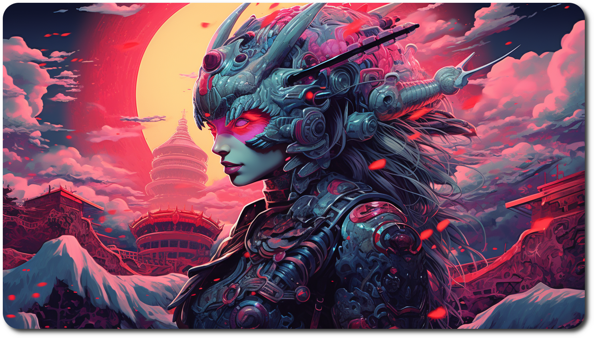

<div align="center">
  <h1>NEON_SAMURAI</h1>

  

<i>An alternative firmware for the Midifighter Twister</i>

  <h4 align="center">
    <a href="#introduction">Introduction</a> -
    <a href="#features">Features</a> -
    <a href="#download">Download</a> -
    <a href="#wiki">Wiki</a> -
    <a href="#contributing">Contributing</a>
  </h4>

  <p>
    
    
    
    <a href="https://github.com/nic-starke/neon_samurai/blob/main/LICENSE">  </a>
  </p>

</div>

## Introduction

NEON_SAMURAI is an alternative firmware for the DJ Tech Tools Midi Fighter Twister. It focuses on extending the original functionality and aims to explore new features (see the features section for more info).

If you use this software you must accept the License, please be aware that using this firmware will likely invalidate your warranty with DJ Tech Tools.

## Features

KEY:

- ✅ Feature implemented.
- ⏲ Feature planned, not complete yet.
- Not planned.

| Feature                      |   Status    |
| ---------------------------- | :---------: |
| Configurable Channels        |     ✅      |
| Acceleration                 |     ✅      |
| Firmware Recovery (DJTT)     |     ✅      |
| 14-bit CC/NRPN               |     ✅      |
| LFOs                         |      ⏲      |
| Virtual Banks                |      ⏲      |
| HID - Mouse/Keyboard         |      ⏲      |
| Standalone Configuration     |      ⏲      |
| Improved Button/Switch Modes |      ⏲      |
| Hyper Knobs                  |     ✅      |
| Open Sound Control (OSC)     |      ⏲      |
| Traktor Sequencer            | Not planned |
| Midi 2.0                     | Not planned |

## Download

Currently there are no releases available - "watch" the project for notification of future releases.

<i> Using this firmware will void your warranty, the software is provided "as is", without warranty of any kind. Please refer to the license.</i>

### Releases

Coming soon.

### Installation

Coming soon.

### Configuring

Coming soon.

## Wiki

Coming soon.

## Contributing

Contributions to make **neosam** even better are welcomed. If you'd like to get involved, you can:

- Report issues or suggest enhancements on our [Issue Tracker](https://github.com/nic-starke/neon_samurai/issues).
- Fork the project, make changes, and submit a pull request to have your improvements considered for inclusion.
- Join our [Discussions](https://github.com/nic-starke/neon_samurai/discussions) to share your ideas, ask questions, or connect with other users.

### Development Environment

#### Dependencies

- avr-gcc (v14)
- avr-libc
- python3
- meson
- cmake
- ninja
- avrdude (for programming flash)
- pre-commit (for githooks)

#### Setting up pre-commit

- install pre-commit
- run `pre-commit install-hooks` and then `pre-commit install` in the root of the project from a terminal.

#### Setting up the build system

- Run the user task `CMake Configure`
- Run the default build task.

#### udev Rules for AVR Programmers

/etc/udev/rules.d/50-avr-isp.rules

```bash
SUBSYSTEM!="usb", ACTION!="add", GOTO="avrisp_end"

#Atmel Corp. JTAG ICE mkII
ATTR{idVendor}=="03eb", ATTR{idProduct}=="2103", MODE="660", GROUP="dialout"
#Atmel Corp. AVRISP mkII
ATTR{idVendor}=="03eb", ATTR{idProduct}=="2104", MODE="660", GROUP="dialout"
#Atmel Corp. Dragon
ATTR{idVendor}=="03eb", ATTR{idProduct}=="2107", MODE="660", GROUP="dialout"
#Atmel Corp. ATMEL-ICE
ATTR{idVendor}=="03eb", ATTR{idProduct}=="2141", MODE="660", GROUP="dialout"
#Atmel Corp. JTAGICE3
ATTR{idVendor}=="03eb", ATTR{idProduct}=="2140", MODE="660", GROUP="dialout"
```

### Contributors

<a href="https://github.com/nic-starke"></a>

### Sponsors

## Analytics


